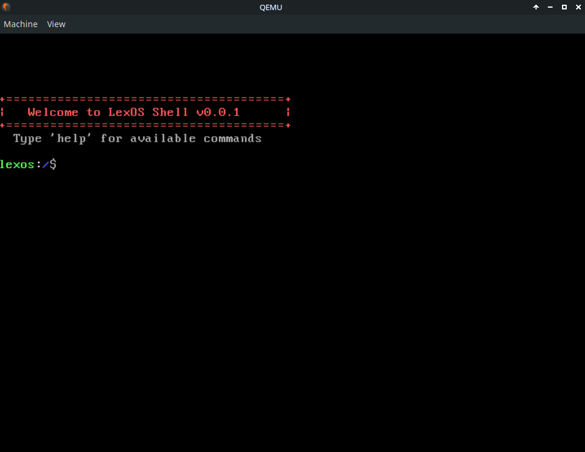

# LexOS - Hobby Operating System




## System Architecture

### Kernel Architecture
- **Type**: Monolithic kernel design
- **Language**: C and Assembly (NASM)
- **Rationale**: Monolithic design chosen for simplicity in an educational context while still demonstrating real OS concepts
- **Compiler**: GCC in freestanding mode (no standard library dependencies)
- **Assembler**: NASM for x86 assembly code
- **Linker**: Custom linker script (`link.ld`) for memory layout control

### User Space Separation
- **Design Decision**: Shell runs as a separate component from the kernel
- **Rationale**: Demonstrates proper OS architecture where user applications are isolated from kernel code
- **Implementation**: Shell has its own directory structure with command parsing and execution logic

### Shell Architecture
- Fully featured command-line shell with command history
- Commands for file operations, system info, utilities
- Uses simfs module for filesystem operations (proper separation of concerns)

### Filesystem Module (simfs)
- **Location**: `fs/simfs/simfs.c`, `fs/simfs/simfs.h`
- **Purpose**: Simple in-memory filesystem module - keeps filesystem logic separate from shell
- **Features**:
  - Directory and file management (mkdir, touch, rm, rmdir)
  - Path resolution and current working directory tracking
  - File content read/write operations
  - Directory listing

### Drivers
- **VGA**: Text-mode VGA driver with color support
- **Keyboard**: PS/2 keyboard driver with scancode translation
- **RTC**: Real-Time Clock driver for date/time via CMOS
- **Serial**: Serial port driver for debugging

### Build System
- **Tool**: Makefile-based build system
- **Target Platform**: QEMU emulator for x86 (32-bit)
- **Build**: `make` to compile


## Project Structure

```
LexOS/
├── kernel/           # Kernel core (entry, IDT, IRQ, timer, memory)
├── drivers/          # Hardware drivers (VGA, keyboard, RTC, serial)
├── fs/               # Filesystem modules
│   ├── vfs/          # Virtual filesystem layer
│   ├── ramfs/        # RAM-based filesystem
│   ├── devfs/        # Device filesystem
│   └── simfs/        # Simple in-memory filesystem (shell uses this)
├── shell/            # User shell implementation
├── lib/              # Standard library (string, stdio)
├── include/          # Common headers and types
├── build/            # Build output (kernel.elf, kernel.bin)
├── Makefile          # Build configuration
├── link.ld           # Linker script
└── grub.cfg          # GRUB bootloader configuration
```
## External Dependencies

### Development Tools (Required)
- **GCC**: Cross-compiler or freestanding mode compiler for kernel development
- **NASM**: Netwide Assembler for x86 assembly code
- **Make**: Build automation
- **QEMU**: x86 emulator for testing the OS (run with VNC in headless mode)

### No Runtime Dependencies
- This is a freestanding OS project with no external library dependencies at runtime
- All functionality must be implemented from scratch or included in the kernel/shell code
